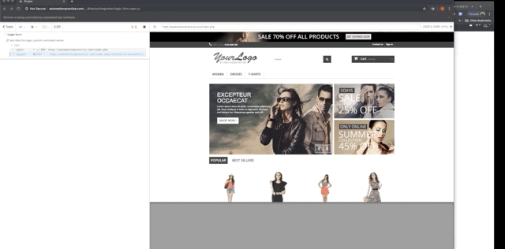

<div class="header">
   <h1 align="center">
      
      <br></br>
      Borges
   </h1>
   <h4 align="center">
      An automated test suite using the
      <a href="https://www.cypress.io"> Cypress </a>
      framework.
   <br>
      <p class="badges" align="center">
         
         
         
      </p>
      <p class="table-of-contents" align="center">
         <a href="#background">Background</a>
         &bull;
         <a href="#prerequisites">Prerequisites</a>
         &bull;
         <a href="#installation">Installation</a>
         &bull;
         <a href="#running-the-tests">Running Tests</a>
         &bull;
         <a href="#notes-on-project-structure">Project Structure</a>
         &bull;
         <a href="#ask-me-why-cypress-is-my-favorite-automated-testing-framework">Framework</a>
      </p>
   </h4>
   <hr>
</div>

### Background
This is an automated test suite that I created using Javascript and Cypress to test [a demo ecommerce site](http://automationpractice.com/index.php). This is a personal project that I created to demonstrate some of the automated testing work that I've done in my previous roles, and more importantly, so I can continue to experiment and learn more about my favorite automated testing framework! Cypress has a desktop application that enables you to run tests, view results, and debug.

### Prerequisites
---
[You need to install NPM](https://www.npmjs.com/get-npm)

### Installation
---
##### 1. Install Cypress
cd into your home directory and run:
`npm install cypress --save-dev`
This will install the desktop app. In the event of any installation hiccups or if you need more specific information, Cypress has excellent [documentation](https://on.cypress.io/guides/installing-and-running#section-installing).

##### 2.Clone this repo
```
// clone this repo 
git clone git@github.com:ameliakindall/Borges.git

// cd into the cloned repo
cd Borges

// install the project dependencies
npm install
}
```
##### 3. Create a cypress.json file
This is included in the .gitignore because it is where local configurations are supposed to go. It's also where the baseUrl is set, so it's **important** that you add this to get the tests to run:
```
// go to the project
cd Borges

// create the file 
cat > cypress.json

// add the following configuration (viewport configurations are optional)
{
  "baseUrl": "http://automationpractice.com/index.php",
  "viewportWidth": 1920,
  "viewportHeight": 1080
}
```
##### 4. Open the Cypress desktop app
Now that everything is installed, you can open the Cypress desktop app and run the tests. To do so, cd into the project and run the following script: `npm run cypress:open` (this is defined in the package.json file).

### Running the tests
---
With the desktop app open, it's as simple as clicking on one of the spec files on the list to run all of the tests in that spec. You can also click the `Run All specs` button on the top right hand corner to run all of them at once. 


This will open up a window with the command log and test status on the left and a preview of the application on the right. From here you can stop the tests, re-run the test, click on commands, and use the chrome dev tools to debug. Again, I won't go into too much detail here about the test runner itself because Cypress does a great job of that [here](https://docs.cypress.io/guides/core-concepts/test-runner.html#Overview).



### Notes on project structure
---
The [project folder structure](https://docs.cypress.io/guides/core-concepts/writing-and-organizing-tests.html#Folder-Structure) is how Cypress projects come out of the box. I'll give you a brief overview and point out any spots where my project deviates from this:
- `cypress/integration` directory contains all of the spec files (in other words, all of the tests)
- `cypress/fixtures` contains data that can be used in the tests, such as when making network requests
-`cypress/support/commands` contains custom commands for behavior that is used all throughout your app, such as logging in.
- `cypress/support/index.js`runs before every single spec file and is a good place to put global hooks
- `cypress.json` is where you put local configurations, such as viewport dimensions, the baseUrl, or passwords and keys

### Ask me why Cypress is my favorite automated testing framework
---
- Automatic waits for element loading and animations + automatic retries = not having to write all sorts of utility methods for explicit waits. This is the biggest pain point for me when writing tests using selenium-based tools.

- Clear error messages and the test runner's visual aids enable anyone on a team to investigate test failures. You can traverse and click on the steps to actually see what the application looked like when a certain command was called. 

- Has access to your app's window and document objects, so you can potentially write tests that call your apps methods directly (instead of using the UI) to speed up tests where you need to set up state. 

### Uh, what's up with the project name?
---
Jorge Luis Borges was an Argentine writer of strange, labyrinthine little metafictions and poems that have absolutely nothing to do with code, automated testing, or my career. This breaks the rules of meaningful and descriptive names for repositories, but the name makes me happy when I see it, and to me, that's worth risking incoherence. Also, no one is going to read this far down :rainbow:

